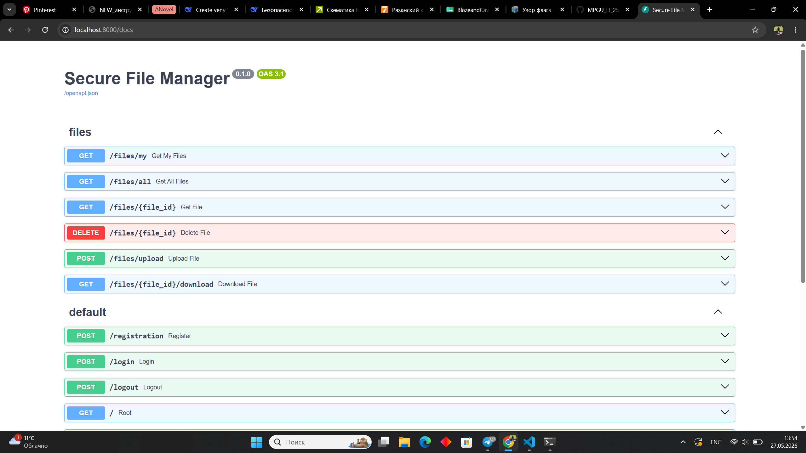

 
 
 
 
 
 


# Secure File Manager

Описание:
Secure File Manager — безопасное веб-приложение для загрузки, хранения и управления файлами. В проекте реализованы меры безопасности: шифрование файлов (Fernet), проверка прав доступа, CSP и другие механизмы защиты.

Ключевые возможности:
- Регистрация и аутентификация пользователей
- Ролевой доступ (User / Admin)
- Безопасная загрузка и скачивание файлов
- Опциональное шифрование файлов с помощью Fernet
- Логирование и мониторинг действий

Технологии:
- FastAPI — API-сервер
- Docker & Docker Compose — контейнеризация
- Postgres — база данных (через Docker-контейнер)
- Fernet (cryptography) — симметричное шифрование файлов
- Pydantic — валидация запросов и схем

Инструкция по запуску (локально):

1. Клонируйте репозиторий:

```bash
git clone https://github.com/Alexandrina-Kuzeleva/SecureProject.git
cd SecureProject
```

2. Создайте файл окружения (пример):

```bash
cp .env.example .env
# Отредактируйте .env (ключи, доступ к БД и т.д.)
```

3. Запустите сервисы через Docker Compose:

```bash
docker-compose up -d
```

4. Проверка работы:
- Откройте браузер: http://localhost:8000/docs — авто-документация Swagger/OpenAPI
- При необходимости просмотрите логи: `docker-compose logs -f`

Описание API:
Полная документация API доступна в Swagger UI по адресу `/docs` после старта приложения (например, http://localhost:8000/docs). Там описаны все маршруты, схемы запросов/ответов и примеры.


