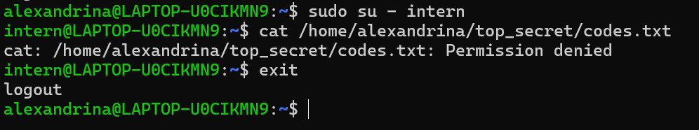

# Report Task 2
## 1. Вывод команды ```ls -ld top_secret``` 
``` bash
alexandrina@LAPTOP-U0CIKMN9:~$ ls -ld top_secret
drwx------ 2 alexandrina alexandrina 4096 Feb 19 17:13 top_secret
alexandrina@LAPTOP-U0CIKMN9:~$
```
## 2. Вывод команды ```ls -l top_secret/codes.txt```
``` bash
alexandrina@LAPTOP-U0CIKMN9:~$ ls -l top_secret/codes.txt
-rw------- 1 alexandrina alexandrina 26 Feb 19 17:13 top_secret/codes.txt
alexandrina@LAPTOP-U0CIKMN9:~$
```
## 3. Скриншот попытки чтения файла от имени пользователя ```intern```

## 4. Вывод команды ```ls -la ~/.ssh```
``` bash
alexandrina@LAPTOP-U0CIKMN9:~$ ls -la ~/.ssh
total 20
drwx------  2 alexandrina alexandrina 4096 Feb 19 17:20 .
drwxr-x--- 10 alexandrina alexandrina 4096 Feb 19 17:17 ..
-rw-------  1 alexandrina alexandrina  109 Feb 19 17:20 authorized_keys
-rw-------  1 alexandrina alexandrina  419 Feb 19 17:17 id_ed25519
-rw-r--r--  1 alexandrina alexandrina  109 Feb 19 17:17 id_ed25519.pub
alexandrina@LAPTOP-U0CIKMN9:~$
```